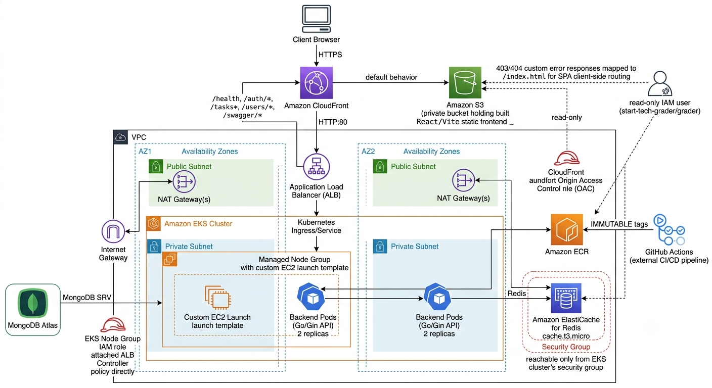

# starttech-infra


Terraform infrastructure for the StartTech DevOps assessment — provisions the AWS resources that host the `much-to-do` full-stack app.

## Architecture



**Modules:**

| Module | Provisions |
|---|---|
| `networking` | VPC, 2 public + 2 private subnets across 2 AZs, IGW, NAT gateways, route tables |
| `eks` | EKS cluster + managed node group (private subnets), IAM role for ALB Controller |
| `storage` | S3 bucket (private, OAC-only) for frontend; ECR repo for backend images |
| `database` | ElastiCache Redis, locked to ingress from the EKS cluster security group only |
| `cdn` | CloudFront distribution — routes to S3 (static assets) and ALB (API) by real backend path prefixes |

## Prerequisites

- Terraform >= 1.5
- AWS CLI configured with credentials for the target account
- `kubectl` (for post-apply steps)

## Deploying

This repo uses a **two-phase apply** because the ALB doesn't exist until the Kubernetes Ingress creates it, and CloudFront needs a real ALB to point at.

```bash
terraform init

# Phase 1 — bring up everything except CDN (ALB doesn't exist yet)
terraform apply -var="alb_exists=false"

# → deploy k8s manifests from starttech-application here (creates the ALB via Ingress)

# Phase 2 — now the ALB exists, build CDN against it
terraform apply -var="alb_exists=true"
```

## Outputs

After a successful apply, check `terraform output` for the current resource identifiers (EKS cluster name, VPC ID, ECR repo URL, S3 bucket name, Redis endpoint, ALB DNS, CloudFront domain/ID) — these are what you'll reference when configuring `starttech-application`'s CI/CD and Kubernetes manifests.

## Notes

- Kubernetes secrets (Mongo URI, Redis host) are created imperatively via `kubectl create secret`, not managed as Terraform resources — kept out of Terraform state deliberately.
- Grader IAM setup (`scripts/setup-grader-iam.sh`) provisions a read-only `start-tech-grader` IAM user for automated assessment and must be re-run against any new AWS account.